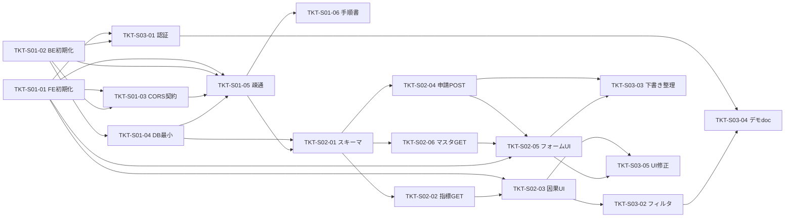

# 開発プランニング（3 スプリント × 1 週間）

| 項目 | 内容 |
|------|------|
| 言語・コミュニケーション | **日本語**（Issue・PR・ドキュメントの標準） |
| スプリント数 | **3 回**（各 **1 週間**） |
| スコープ外 | **`dashboard/` モックの改修**（参照専用。本番実装は `frontend/` / `backend/` 想定） |
| ステータス | プランニング記載済み → **次工程: GitHub Issue への分解** |

---

## 1. 目的

`docs/requirements/` および Figma（因果ストーリー・ポイント申請等）を前提に、**新規 `frontend/`・`backend/`** 上で MVP 相当の動く縦スライスを目指す。そのための **3 週間の時間箱** と週次ゴールを定義する。

---

## 2. スプリントの切り方

- **Sprint 1 Day 1**: キックオフ日（**開始日は別途決定**。決まったら本表に追記する）
- 各スプリントは **7 日間**（営業日ベースでタスクを並べてよい）
- 水曜キックの講義サイクルと揃える場合は、**水曜始まり**を推奨

| スプリント | 期間の呼び方 | ゴール（要約） |
|------------|----------------|----------------|
| **スプリント 1** | 週 1 | **リポジトリ方針の固定**と **フロント／バックのスカフォールド**、ローカルで API と画面がつながる最小経路 |
| **スプリント 2** | 週 2 | **因果ストーリー（閲覧）**と **ポイント申請（入力）**の **縦スライス**（ダミー or DB 要合意） |
| **スプリント 3** | 週 3 | **認証・フィルタ等の不足埋め**、デモシナリオ通し、ドキュメント・既知不具合の整理 |

### 2.1 開始日（未記入欄）

| スプリント | 開始日 | 終了日（目安） |
|------------|--------|----------------|
| スプリント 1 | **TBD** | 開始 +6 日 |
| スプリント 2 | **TBD** | 開始 +6 日 |
| スプリント 3 | **TBD** | 開始 +6 日 |

### 2.2 最終発表日と実質稼働

- 最終発表が **5/20** のように固定されると、カレンダー上は **「3 スプリント × 1 週間」とはきれいに一致しない**ことがある。
- 講義・週末・バッファを除くと **実質 2 週間前後**しかない、という前提もあり得る。
- その場合は **エピック 3 を全面展開する**より、**デモで通しで見せるストーリー**（因果ストーリーの閲覧 + ポイント申請の入力）を最優先し、認証・フィルタ・ドキュメントは **最小化・割り切り**を検討する（各 Issue の「スコープ外」も活用）。

### 2.3 チーム分担（3 人）：**B プラン（縦割り）採用**とトラック割り

短い期間では **同じファイルを複数人が触る**と PR のコンフリクトとレビュー負荷が増えやすい。比較した **A（FE / BE の役割トラック）**と **B（ストーリー縦割り）**のうち、**B を採用**した。

| 方針 | 内容 | メリット | 注意 |
|------|------|----------|------|
| **A: 役割トラック** | **FE 主**（`frontend/`）、**BE 主**（`backend/`）、**結合・手順・デモ**（`docs`・CORS 調整・動作確認）、必要なら **フロート**（詰まり先へ投入） | 責務がはっきりし、**同一ディレクトリの競合が相対的に少ない** | API 契約（パス・型・環境変数）の **インプットに時間がかかりやすい**（今回の判断理由） |
| **B: 縦割り（Issue／ストーリー単位）** | 機能トラックごとにオーナー。**同一ストーリー内で FE / BE をまとめて**進め、API は必要最小限をその場で決める | **待ち行列を減らし**、オーナーがコンテキストを持ち続けやすい | **最小スキーマ（GitHub では #10）**は複数トラックから参照されるため、**最初に短時間でマージ**する／**ペアで実施**すると安全 |

**採用理由（要約）**: FE と BE を切り分けると、**API 周りのすり合わせに時間がかかる**ため。縦割りの方がチームの体感で進めやすい。

**人数とフロート**: **3 人**体制。**詰まりやすいトラックを優先しつつ**、空いた 1 人は **他トラックのタスクを手伝う**（フロート）。日次で **main の状態・ブロッカー**を共有する。

#### トラック分解（シンプル版）

| トラック | スコープ（要約） | 主オーナー（GitHub） |
|----------|------------------|----------------------|
| **①** | 因果ストーリー・ダッシュボード（指標・一覧・検索・フィルタ等） | **[@jun-ichi106](https://github.com/jun-ichi106)**（口頭では tom106。リポジトリの Collaborator はこのアカウント） |
| **②** | ポイント申請・承認・通知（フォーム〜ワークフロー・通知 UI） | **[@misakikuboshima](https://github.com/misakikuboshima)** |
| **③** | その他（ログイン・ログアウト、データ基盤、スキーマ、デプロイ、起動手順・デモ doc 等） | **[@Shun0914](https://github.com/Shun0914)** |

**既存 Issue との対応（目安）**

| トラック | 主に該当する Issue（例） |
|----------|--------------------------|
| ① | #11, #12, #17（必要に応じ #10 と連携） |
| ② | #13, #14, #15, #18、エピック **#21** と **#22〜#25** |
| ③ | #4〜#9, **#10**, #16, #19、（横断）#20 |

※ **#10（最小スキーマ）**はトラック **③** がリードし、①②が依存する。**#2（スプリント2エピック）**は①②にまたがるため、親子リンクとコメントで同期する。

---

## 3. スプリント別：成果物・主な作業

### スプリント 1 — 基盤・スカフォールド

- **フロントエンド**（`frontend/` 新設想定）
  - Next.js（または合意したスタック）の初期化、Lint / フォーマット、環境変数の型
  - レイアウト骨格（サイドバー／ヘッダーは Figma に寄せたプレースホルダで可）
- **バックエンド**（`backend/` 新設想定）
  - FastAPI 等の初期化、ヘルスチェック、CORS・設定分離
  - DB 接続方針（SQLite ローカル / Docker / クラウド）は **週内に決定または仮決定**
- **共通**
  - `README.md` または `docs/` に **起動手順**を追記
  - **モック `dashboard/` は触らない**（必要ならスクリーンショットのみ参照）

**週末の出口基準（案）**: ローカルで「フロント → API →（DB またはモック応答）」が 1 本通る。

---

### スプリント 2 — コア機能（縦スライス）

- **因果ストーリー相当**: タブ・カード一覧・検索 UI のうち、要件で優先度高の範囲を実装（データはシード JSON / DB のいずれか）
- **ポイント申請フォーム相当**: タイトル・ジャンル・ポイント・活動内容・承認者 UI（承認ワークフローは API が未ready ならクライアントのみ + スタブ）
- **データ**: `docs/requirements/04_データ要件.md` のエンティティ案に沿った **最小スキーマ** の導入

**週末の出口基準（案）**: デモ担当が **画面操作だけで**「見る → 入力する」のストーリーを説明できる。

---

### スプリント 3 — 結合・デモ仕上げ

- **認証**: ログイン／ログアウト（デモアカウントで可。本番 SSO はスコープ外でもよい）
- **フィルタ・ソート**: 要件 `DASH-05` 範囲のうち、デモに必要な分
- **品質**: 主要画面の表示崩れ修正、簡易エラーハンドリング
- **ドキュメント**: デモ手順、既知の制限事項一覧

**週末の出口基準（案）**: `docs/requirements/02_機能一覧.md` の **MVP チェックリスト** に近い状態でデモ可能（未実装は「制限事項」に明示）。

---

## 4. 明示的にやらないこと（本プランニング期間）

| 項目 | 理由 |
|------|------|
| **`dashboard/` 以下の機能追加・デザイン変更** | モックは凍結。本実装は `frontend/` |
| **本番 Azure・本番 DB 接続の完成** | 週次内に仮環境でよい場合は Issue で個別判断 |
| **因果チェーン v9.2 のロジック確定** | 経営・人事側の合意が必要。コード化は別タスク |

---

## 5. 参照ドキュメント

- `docs/requirements/README.md` — 要件索引
- `docs/requirements/01_基本要件定義書.md` — スコープ・Figma 対応
- `docs/requirements/02_機能一覧.md` — 機能 ID・MVP チェックリスト
- `docs/requirements/03_非機能要件.md`
- `docs/requirements/04_データ要件.md`
- `docs/design/サービス企画資料_整理版.md`
- リポジトリ直下 `README.md` — ディレクトリ方針

---

## 6. チケットの切り方（原則）

**2026-05 ミーティング反映**: チケットは **機能単位**で切り、**もう少し粗い粒度**を許容する（1 Issue = **縦スライス 1 本**に近い単位でもよい）。**FE / BE で無理に分割しない**方が、B プラン（§2.3）と整合しわかりやすい。既存の `[Frontend]` / `[Backend]` 付き Issue は、**統合・リネーム・クローズ**してよい（親エピックの本文で子を束ねる）。

GitHub Issue 1 件の目安: **2〜5 日相当の機能ストーリー**（チーム合意で調整）。跨ぎが大きい場合のみ **親 Issue（エピック）+ 子**に分割する。

| 項目 | 推奨 |
|------|------|
| **タイトル** | **機能名 + 動詞**（例: `因果ストーリー画面をデモ範囲で実装する`）。スプリント接頭辞は任意 |
| **1 Issue に含める** | **API + 画面**を同一ストーリーで完結させる縦スライス、受け入れ条件 2〜5 個 |
| **分ける** | **レイヤではなく**、**マージ単位**（リスク・レビュー負荷）で分ける |
| **親子** | エピックは **マイルストーン**または **親 Issue** で追跡。子は本文先頭に `親: #123` |
| **依存** | 本文に `## 依存` と **先行 Issue 番号**（マージ済みであること）を書く |
| **モック** | `dashboard/` 改修はチケットに **含めない**（スコープ外） |
| **要件トレース** | 本文に `## 要件` と `DASH-01` / `WF-02` 等の ID を列挙 |
| **ラベル `area:*`** | 参考用。**アサインの正**は §2.3 のトラックオーナー |

### ラベル付け（例）

| ラベル | 付与条件 |
|--------|----------|
| `area:frontend` | `frontend/` のみ変更 |
| `area:backend` | `backend/` のみ変更 |
| `area:docs` | `docs/`・ルート README のみ |
| `type:task` | 実装タスク |
| `type:epic` | 親 Issue・追跡用 |
| `type:chore` | ツール整備・設定のみ |
| `mvp` | 3 スプリント内のデモ必須経路 |

### ネクストアクション（運用）

1. **Issue の再編**: 粒度を **機能別・やや粗め**に揃える（#22〜#25 のような FE 分割は **1 Issue に統合**してもよい）。  
2. **ドキュメント**: 本書・`docs/requirements/04_データ要件.md`（通知テーブル等）を継続更新。  
3. **アサイン**: GitHub の Assignees を **§2.3 のトラック**に合わせる。  
4. **データ**: 通知用テーブル（`Notification`）を **#10 以降のマイグレーション**に反映（詳細はデータ要件 §2.5）。

---

## 7. チケット一覧（案）と依存関係

下表の **チケット ID** は GitHub 上の番号ではなく、**ドキュメント内参照用**（Issue 作成後は本文で相互リンク）。

### 7.1 エピック（親）

| チケット ID | 種別 | スプリント | 概要 | 含める子タスク（§7.2） |
|-------------|------|------------|------|-------------------------|
| **TKT-EP-01** | epic | 1 | 基盤・スカフォールド | S01-01 〜 S01-06 |
| **TKT-EP-02** | epic | 2 | コア縦スライス（因果ストーリー + 申請） | S02-01 〜 S02-06 |
| **TKT-EP-03** | epic | 3 | 認証・フィルタ・デモ仕上げ | S03-01 〜 S03-05 |
| **TKT-EP-04** | epic | （フェーズ2／3スプリント外） | ワークフロー・通知（Figma 5-801／5-1279／5-1506） | GitHub **#22〜#25**（親 **#21**） |

### 7.2 タスク一覧

| チケット ID | スプリント | タイトル（Issue 用コピー可） | 先行（完了が条件） | 主な関連要件 | area |
|-------------|------------|------------------------------|-------------------|--------------|------|
| **TKT-S01-01** | 1 | `frontend` を初期化し Lint / フォーマットを通す | — | — | frontend |
| **TKT-S01-02** | 1 | `backend` を初期化しヘルスチェック API を返す | — | — | backend |
| **TKT-S01-03** | 1 | CORS・API ベース URL・環境変数の契約を決めフロントに反映 | S01-01, S01-02 | — | frontend, backend |
| **TKT-S01-04** | 1 | DB 方針を文書化し最小接続（または SQLite ローカル）を通す | S01-02 | データ要件 | backend |
| **TKT-S01-05** | 1 | フロントから API を 1 コールし結果を画面表示（疎通確認） | S01-01, S01-02, S01-03 | — | frontend |
| **TKT-S01-06** | 1 | 起動手順を README / docs に追記 | S01-05 | — | docs |
| **TKT-S02-01** | 2 | 最小スキーマ（指標・申請）を定義しマイグレーション | S01-04, S01-05 | IN-*, DASH-* | backend |
| **TKT-S02-02** | 2 | 指標一覧 GET・シードデータ API | S02-01 | DASH-01 | backend |
| **TKT-S02-03** | 2 | 因果ストーリー画面（タブ・一覧・検索のデモ範囲） | S01-01, S02-02 | DASH-01〜03 | frontend |
| **TKT-S02-04** | 2 | ポイント申請の POST（下書き含む）API | S02-01 | IN-02〜05, IN-08 | backend |
| **TKT-S02-05** | 2 | ポイント申請フォーム画面 | S01-01, S02-04, S02-06 | IN-01〜06 | frontend |
| **TKT-S02-06** | 2 | 活動ジャンル等マスタ GET（スタブ可） | S02-01 | IN-03, IN-06 | backend |
| **TKT-S03-01** | 3 | ログイン・ログアウト（デモアカウント） | S01-01, S01-02 | AUTH-01, AUTH-02 | frontend, backend |
| **TKT-S03-02** | 3 | ダッシュボードのフィルタ・ソート（DASH-05） | S02-03 | DASH-05 | frontend |
| **TKT-S03-03** | 3 | 下書き保存・バリデーションの整理 | S02-04, S02-05 | IN-08 | frontend, backend |
| **TKT-S03-04** | 3 | デモ手順・既知の制限事項を docs に記載 | S03-01, S03-02 | — | docs |
| **TKT-S03-05** | 3 | 主要画面の UI 調整・表示崩れ修正 | S02-03, S02-05 | — | frontend |

#### 7.2.1 フェーズ2（ワークフロー・通知）— GitHub Issue

当初の 3 スプリント表（§7.2）には含まれていなかった **申請状況・承認・通知** を、**別エピック（TKT-EP-04）**として追跡する。Issue はリポジトリに作成済み（親 **#21**、子 **#22〜#25**）。

| GitHub | チケット ID（ドキュメント） | タイトル（要約） | 先行（完了が条件） | 主な関連要件 | area |
|--------|---------------------------|------------------|---------------------|--------------|------|
| **#21** | TKT-EP-04 | ワークフロー・通知（親エピック） | #13, #15, #16 | WF-01〜04 | — |
| **#22** | — | 申請ワークフロー API（一覧・承認・通知） | #13, （親 #21） | WF-01〜04 | backend |
| **#23** | — | ポイント申請状況（Figma 5-801） | #22 | WF-04 | frontend |
| **#24** | — | ポイント承認（Figma 5-1279） | #22 | WF-01, WF-03 | frontend |
| **#25** | — | 通知一覧（Figma 5-1506） | #22 | WF-02 | frontend |

**並行**: **#23 / #24 / #25** は **#22** マージ後に同時着手可。

### 7.3 依存関係（DAG）

**意味**: 「先行」列にあるチケットの **マージ完了後** に着手（または PR レビュー開始）。

**並行可能な例**

- **S01-01 と S01-02** は同時着手可。
- **S02-02 / S02-04 / S02-06** は S02-01 後に並列可。
- **S02-03 と S02-05** は、それぞれ API 準備ができ次第並列可（S02-05 は S02-04 に、S02-03 は S02-02 に依存）。

### 7.4 クリティカルパス（参考）

`S01-01` ∥ `S01-02` → `S01-03` → `S01-04` → `S01-05` → `S01-06` →（週境界）→ `S02-01` → `S02-02` → `S02-03` と `S02-04` → `S02-05` →（週境界）→ `S03-01` → `S03-02` → `S03-04`（`S03-05` は並行可）

---

## 8. GitHub 連携（次ステップ）

1. **マイルストーン**: `スプリント1` `スプリント2` `スプリント3` を作成し、§7.2 の各行を紐づける
2. **ラベル**: §6 の表をリポジトリに作成
3. **Issue**: **エピック 3 本**（§7.1 のスプリント 1〜3）＋ **フェーズ2 エピック**（**#21** TKT-EP-04、§7.2.1）。§7.2 を **1 Issue = 1 行**で作成。本文に `親: #…` `## 依存` `## 要件` を入れる

Issue 本文は **日本語**、参照は `docs/requirements/01_基本要件定義書.md` 等へのリンク。

---

*更新履歴: 初版 — 3 スプリント・1 週間・モック対象外・言語日本語。追記 — §6 チケット切り方、§7 一覧・依存（Mermaid）、§8 GitHub。追記 — §2.2 最終発表・実質稼働、§2.3 チーム分担（A/B と短い期間向け）。追記 — §7.1 TKT-EP-04、§7.2.1 GitHub #21〜#25（ワークフロー・通知）。追記 — §2.3 B プラン採用・3 トラック・アサイン、§6 粒度見直し・ネクストアクション。追記 — トラック①の GitHub アカウントを **jun-ichi106** に修正（口頭の tom106 と同一人物）。*
